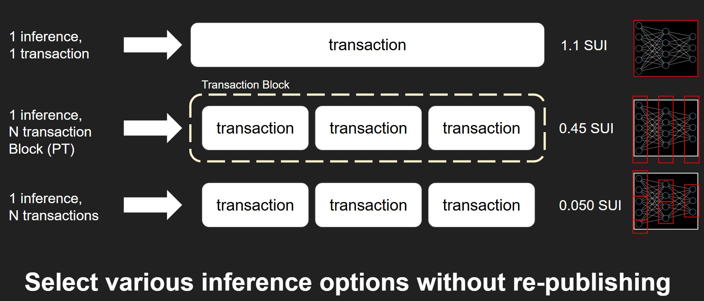
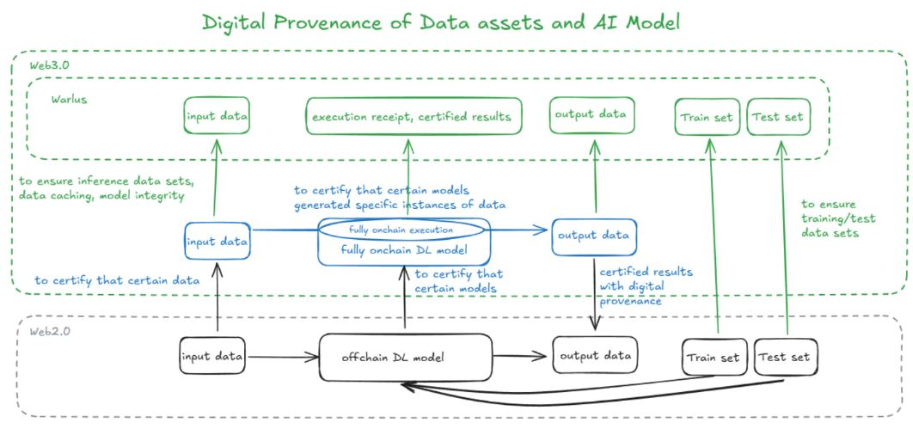
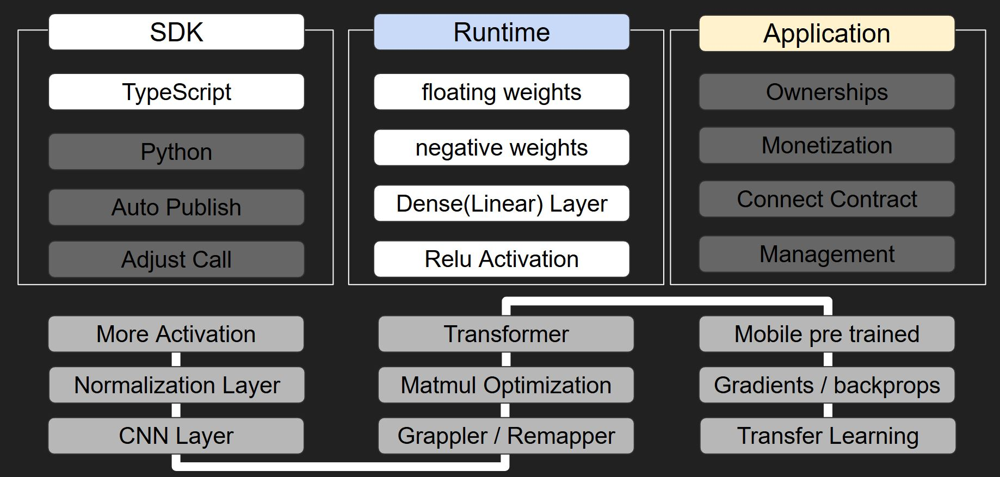

<p align="center">
  
</p>

🏆 **Winner - 1st Place, Sui AI Typhoon Hackathon (Sui Track)**
<p align="center">
  
</p>

join and stay tuned for our future fantastic updates.
https://x.com/OpenGraph_Labs


latest version (v1.0.1) packageId: 0x068c9c0c7c9a1fcd44d9af6bebe5d4e364cfb79eb4a1c4e0c78a88aee59c83c7


# Tensorflowsui

Tensorflowsui aims to bridge **Web2-based DL/ML models** to a **fully decentralized on-chain environment**, enhancing the **transparency**, **reproducibility**, **auditability**, **operational efficiency**, and **connectivity** of AI models. By providing trust and predictability for otherwise untestable "black box" AI systems, Tensorflowsui delivers effective **risk management** solutions for AI models.

Our **fully on-chain inference** approach:
- **Ensures objective reliability** of the model's predictions
- **Defines algorithmic ownership** on the blockchain
- **Encourages industrial-scale mass adoption** of on-chain agents

Tensorflowsui's ultimate goal is to **democratize** AI by making deep learning (DL) and machine learning (ML) models verifiable, trustworthy, and easily integrable into decentralized applications (dApps) and beyond.

---

## Key Features

- **Fully On-Chain Execution**  
  Run DL/ML models directly on-chain for maximum transparency and security.

- **High Trust & Predictability**  
  Eliminate the risks of "black box" AI through verifiable inference processes that can be audited and reproduced.

- **Ownership & Accountability**  
  Clearly define algorithmic ownership, enabling fair usage rights and licensing on the blockchain.

- **Mass Adoption**  
  Pave the way for on-chain AI agents to be deployed in real-world industrial scenarios, thanks to transparent and provable computations.

## TensorflowSui Library

The `@tensorflowSui_lib` provides core functionality for interpreting and executing Web2 AI models (trained with frameworks like TensorFlow and PyTorch) in a fully on-chain environment.

### Core Components

- **tensor.move**  
  - Implements tensor operations with fixed-point arithmetic
  - Handles signed number computations
  - Supports multi-dimensional tensor operations
  - Provides optimized matrix multiplication
  - Includes batch processing capabilities

- **graph.move**  
  Handles AI model structure interpretation, including:
  - Dense (fully connected) layers
  - ReLU and Softmax activations
  - Batch normalization
  - Model weight management
  - Partial computation support for gas optimization

### Implementation Features

- **Fixed-point Precision**
  - Configurable scale parameter for numerical accuracy
  - Prevents floating-point inconsistencies on-chain
  - Maintains computational stability

- **Gas Optimization**
  - Chunked computation support
  - Batch processing capabilities
  - Memory-efficient tensor operations
  - Partial state management

- **Safety Measures**
  - Input validation and dimension checking
  - Overflow prevention
  - Scale consistency verification
  - Memory safety through Move's ownership system

### Inference Options

<p align="center">
  
</p>


The library offers three flexible inference approaches to balance between atomicity, cost, and efficiency:

1. **One Transaction Inference**
   - All computations performed in a single transaction
   - Fully atomic execution
   - Higher gas costs due to accumulated computations
   - Best for simple models or when atomicity is critical

2. **Programable Transaction Block (PTB) Inference**
   - Leverages Sui's PTB functionality to split computations
   - Maintains atomic execution while reducing costs
   - Computations can be split by layers
   - Optimal balance between atomicity and efficiency

3. **Split Transaction Inference**
   - Divides computation across multiple transactions
   - Uses partial state boxes for intermediate results
   - Lowest gas costs
   - Non-atomic execution
   - Recommended to use with Walrus for transaction trajectory and output verification

These options can be mixed and matched within the same model to optimize for specific requirements. For example, you could use PTB inference for critical computations while using split transactions for less sensitive operations, allowing for a customized balance between security and efficiency.

Choose the inference option or combination that best matches your requirements for atomicity, cost efficiency, and execution speed.

---

## SUI AI Typhoon Hackathon


<p align="center">
  
</p>


# Digital Provenance of Data Assets and AI Model

A decentralized system for ensuring data provenance and model integrity in AI/ML workflows using blockchain technology.

## Vision

This project aims to establish a robust framework for maintaining digital provenance of both data assets and AI models in a decentralized environment. By leveraging blockchain technology, specifically the Sui blockchain, we ensure:

- Transparent tracking of data lineage
- Verifiable model execution
- Immutable record of training/test datasets
- Certified model inference results

## System Architecture

The system consists of several key components working together:

### 1. Web3.0 Layer (./walrus, ./tensorflowSuiLib)
- Handles blockchain interactions and smart contract execution
- Manages digital signatures and provenance certification
- Provides verifiable execution receipts

Start the Go server that handles Walrus interactions:
```bash
cd walrus
go run .
```

### 2. Model Publisher (./modelPublisher)
- Deploys AI models to the blockchain
- Manages model versioning and updates
- Handles model weight distribution

The Model Publisher simplifies the process of deploying Web2 AI models to the Sui blockchain:

1. **Prepare Your Model**
   - Convert your .h5 model to TensorFlow.js format:
     ```bash
     tensorflowjs_converter --input_format=keras /path/to/model.h5 /path/to/tfjs_model
     ```
     here ! https://www.tensorflow.org/js/guide/conversion?hl=en
   - Place the converted model in the `web2_models` directory

2. **Configure Publishing**
   - Update `config.txt` with your settings:
     ```ini
     PRIVATE_KEY=your_private_key
     NETWORK=devnet  # or testnet/mainnet
     SCALE=2         # decimal precision for fixed-point conversion
     MODEL_PATH=./web2_models
     ```

3. **Run the Publisher**
   ```bash
   cd modelPublisher
   node model_publish.js
   ```

The publisher will:
- Load and process your TensorFlow.js model
- Convert weights to fixed-point representation
- Auto-generate Move smart contracts
- Deploy to the specified Sui network
- Save the package ID for future reference


### 3. Model User (./modelUser)
- Performs model inference
- Verifies execution results
- Interacts with the blockchain for provenance tracking


The Model User component provides a CLI interface for interacting with deployed models and performing inference:
For using models from SUI packageId:
- Downloads input data from Walrus with digital provenance
- Performs fully on-chain inference
- Provides transaction verification

1. **Setup**
   ```bash
   cd modelUser
   npm install
   ```

2. **Configure**
   - The package ID from the published model will be automatically loaded from `packageId.txt`
   - Update `config.txt` with your settings:
     ```ini
     PRIVATE_KEY=your_private_key
     NETWORK=devnet  # or testnet/mainnet
     ```

3. **Run Inference**
   ```bash
   node inference.js
   ```

   The CLI supports three commands:
   - `init`: Initialize the model state
   - `load input`: Load input data from the Walrus server
   - `run`: Execute the inference process mixed inference options (split transaction and PTB)

4. **Hybrid Inference Process**
   The implementation uses a hybrid approach combining two inference methods:
   - **Split Transaction** for the input layer → layer 1
     - Divides computation into 16 partitions for efficiency
     - Provides progress visualization
     - Optimizes gas costs for heavy computations
   
   - **PTB (Programable Transaction Block)** for layers 2 → 3 → output
     - Maintains atomic execution
     - Processes remaining layers in a single transaction
     - Outputs final classification result

5. **Walrus Integration**
   - All transaction trajectories are automatically uploaded to Walrus
   - Provides verifiable proof of computation
   - Access results via Walrus Explorer: `https://walruscan.com/testnet/account/{blobId}`


### 4. Atoma Framework (./atoma)
- Handles input data generation and preprocessing
- Converts traditional ML inputs to blockchain-compatible format
- Manages data transformation pipelines


Hybrid Inference Architecture

Tensorflowsui supports both on-chain and off-chain inference through a hybrid architecture:

1. **On-Chain Inference (Small Models)**
   - Fully decentralized execution for lightweight models
   - Complete transparency and auditability
   - Suitable for:
     - Classification tasks
     - Simple neural networks
     - Time-critical applications

2. **Atoma Network Integration (Large Models)**
   - Leverages Atoma Network for large model inference
   - Maintains connection to Sui blockchain for verification
   - Supports models like:
     - LLMs (e.g., Llama-3.3-70B)
     - Complex deep learning architectures
     - Resource-intensive tasks


The `atoma` directory provides tools for generating model inputs using Atoma Network:

```bash
cd atoma
npm install
node input_data_generation_with_atoma.js
```

Key components:
- `input_data_generation_with_atoma.js`: Generates inputs using Atoma's LLM capabilities
- `convert_data_for_web3_input.js`: Converts generated data for on-chain use
- `atoma_converted.json`: Stores processed input data

This hybrid approach enables:
- Scalable inference for both small and large models
- Decentralized verification of model outputs
- Flexible deployment options based on model size and requirements

---


## Key Features

1. **Data Provenance**
   - Track data lineage from source to inference
   - Verify data integrity at each step
   - Maintain immutable audit trails

2. **Model Integrity**
   - On-chain model execution
   - Verifiable computation results
   - Transparent model updates

3. **Decentralized Storage**
   - Distributed data storage
   - Content-addressed blob storage
   - Efficient data retrieval

4. **Smart Contract Integration**
   - Move language implementation
   - Fixed-point arithmetic for deterministic computation
   - Gas-optimized operations


## Ecosystem Benefits

1. **For Data Scientists**
   - Verifiable training datasets
   - Transparent model development
   - Reproducible results

2. **For Model Users**
   - Trusted inference results
   - Verified model lineage
   - Transparent execution

3. **For Stakeholders**
   - Auditable AI systems
   - Compliance tracking
   - Risk management


## Future Roadmap

<p align="center">
  
</p>

Our development roadmap outlines planned expansions across three key areas:

### SDK
- TypeScript support (Available)
- Python integration
- Auto-publish capabilities 
- Adjustable calling mechanisms

### Runtime
- Floating & negative weights support
- Dense (Linear) Layer implementation
- ReLU Activation
- Future additions:
  - More activation functions
  - Normalization layers
  - CNN support

### Application
- Ownership management
- Monetization features
- Smart contract connectivity
- Platform management tools
- Planned integrations:
  - Transformer architectures
  - Matrix multiplication optimizations
  - Advanced mapping tools
  - Mobile pre-trained models
  - Gradient/backprop support
  - Transfer learning capabilities

---


## Contributing

We want to co-develop with those who share our vision.  
Feel free to reach out at any time via the link or email below:

https://www.opengraphlabs.xyz/


- **LinkedIn**: [Jun-hwan Kwon](https://www.linkedin.com/in/jun-hwan-kwon/)
- **Email**: [gr0442@gmail.com](mailto:gr0442@gmail.com)

Junhwan Kwon, Ph.D. by OpenGraph


- **LinkedIn**: [yoong-doo Noh](https://www.linkedin.com/in/yoongdoo-noh-459875168/)
- **Email**: [yoongdoo0819@gmail.com](mailto:yoongdoo0819@gmail.com)

Yoongdoo Noh, by OpenGraph


- **LinkedIn**: [Julia Kim](https://www.linkedin.com/in/julia-kim-62302a21b/)
- **Email**: [jooho0129@gmail.com](mailto:jooho0129@gmail.com)

Julia Kim, by OpenGraph


- **Email**: [styu12@naver.com](mailto:styu12@naver.com)

Jarry Han, Sui Ambassador, by Sui Korea

and, Sui Korea peoples. lead by Harrison Kim.


## License

This project is licensed under the Apache License 2.0 - see the LICENSE file for details.

## SUI AI Typhoon Hackathon Transactions

### 1. Model Publishing
**Transaction (modelPublisher/publish_model.js)**
- [View Model Deployment Transaction](https://suiscan.xyz/testnet/tx/CRiyiUuynovrkrESxRzYBnDxR9qJTyZaJXR7uVXLaNAP)

### 2. Model Inference
**Initialization (modelUser/inference.js)**
- [View Init Transaction](https://suiscan.xyz/testnet/tx/GkGjKAaxFi4RMp7wCYXmZFti6VJVewcDYcVi8mUnRzAj)

**Created Objects**
- [FixedGraph Object](https://suiscan.xyz/testnet/object/0xf28bc3c057373834cb63582ca4ce673e0ebada4fd3ad898d61f70e2d33a12e1e/tx-blocks)
- [Partial Object](https://suiscan.xyz/testnet/object/0x6428ccab98ddce1a665e878327f29e84736df986b9ba83f4bd2f77a500794d2b/tx-blocks)

**Inference Execution**
1. Input Layer → Layer 1 (Split Transactions)
<details>
<summary>View 16 Split Transactions</summary>

| Partition | Transaction Link |
|-----------|-----------------|
| 1  | [View on SuiScan](https://suiscan.xyz/testnet/tx/9H2hfK6pB88c1nb5yo4tAdLmpus9cz3X11AnJVzWM7gZ) |
| 2  | [View on SuiScan](https://suiscan.xyz/testnet/tx/UPrZU8TgcmEbn58djHCK8UZ1f8tpzAsFWh4tLgyHdr9) |
| 3  | [View on SuiScan](https://suiscan.xyz/testnet/tx/75npkzNPCEcNycnLXHzi3njhsMtSFtKUhTwWwwMuemB2) |
| 4  | [View on SuiScan](https://suiscan.xyz/testnet/tx/64LaxLN7znxS1YZs7QFqY4V8XfCBUVBgJipVFeqUhXF4) |
| 5  | [View on SuiScan](https://suiscan.xyz/testnet/tx/5CgUWEwZUv7vGzCPbqbVrtNbiRbcMe7aVHENBamcutxj) |
| 6  | [View on SuiScan](https://suiscan.xyz/testnet/tx/6ZafBkQHCogd729Fa7WGunrizVhYwRgnbweDaB6hVZR5) |
| 7  | [View on SuiScan](https://suiscan.xyz/testnet/tx/Dkw9Lp8R2FikcR396BeRhqo6tZjgZU6hjN92W1eAFnAH) |
| 8  | [View on SuiScan](https://suiscan.xyz/testnet/tx/B7uy2mnJtGRHyxrGYG8mqHqBJXHEim73ort8cLiEka7D) |
| 9  | [View on SuiScan](https://suiscan.xyz/testnet/tx/DNidRTdRGTikybYXUBEP5TBycfBon4AbyLqWpiXG7HxB) |
| 10 | [View on SuiScan](https://suiscan.xyz/testnet/tx/G1AyVfjXsYHHrsWUqv2guVUsqyLheTPpq4SPp8d52Co2) |
| 11 | [View on SuiScan](https://suiscan.xyz/testnet/tx/B8DRJpNYq3pM7WzDcxtpfhZ7pRmWA1dgwfWKSGMip28n) |
| 12 | [View on SuiScan](https://suiscan.xyz/testnet/tx/AZVvS8L4z7HYMdu9vdBS6GxP7WBAjphoQZc6QsdNeLrL) |
| 13 | [View on SuiScan](https://suiscan.xyz/testnet/tx/2hsHW5U2D1NNwjbKZ6aTwnQ3RExviVf8A24p1ZMBLHvk) |
| 14 | [View on SuiScan](https://suiscan.xyz/testnet/tx/7LgJWnvpwcsqDu1Z9fpraqrsGxocz3cXtCDBRrwWc6G5) |
| 15 | [View on SuiScan](https://suiscan.xyz/testnet/tx/HVkWiT17TdHmGZA6apc6ySB4hpa9VNBTYknkjCxRSicx) |
| 16 | [View on SuiScan](https://suiscan.xyz/testnet/tx/HVfEbbXRGhfHwpXxBrHhQ7bucTAy4k5rztSyKGkcfUvW) |
</details>

2. Layer 1 → Layer 2 → Output (PTB Transaction)
- [View Final PTB Transaction](https://suiscan.xyz/testnet/tx/BBSUh8ujnHGAVGft6NvPq632gjVg1GEbCiM7W1eqBrd9)


